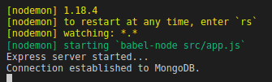

# API with NodeJs, Mongodb and ReactJs 

### Installation and Usage

Prerequisites Backend: 
* [Node.js](https://nodejs.org/en/)
* [Mongodb](https://www.mongodb.com/) 

Prerequisites Frontend: 
* [ReactJs](https://reactjs.org/)

Into the folders backend and frontend, run the comand:
```sh
$ npm install 
```
 
Start the server in the folder backend with command:
 ```sh
 $ npm run dev
 ```
This comando will runing the projetc with the babel and nodemon

[Babel.js](https://babeljs.io/) is a JavaScript compiler. He can transform a code written with ES6 specifications into something that Node.js can fully understand.



These are the Routes API 

This is the route that verifies  the token validate  GET /users/verify 
router.get('/verify', verifyToken)
requested: req.header

This is the route that show all uses in the   GET /users
router.get('/', findAll);
requested: don't have

This is the route that find one by ID  GET /users/5bac1f4980701043b4bb0b80 
router.get('/:id', findOne);
requested:id:(req.params)

This is the route that create a new user POST /users
router.post('/', create);
requested: 
```sh
email:
first_name:
last_name:
personal_phone:
password: 
```

This is the route that delete a user by ID DELETE /users/5bac1f4980701043b4bb0b80
router.delete('/:id', remove);
requested:id(req.params)

This is the route that Update a user by ID  PUT /users/5bac1f4980701043b4bb0b80
router.put('/:id', update);
requested:
```sh
id:(req.params)
email:
first_name:
last_name:
personal_phone:
```


This is the route that change  the password after confirm current password PUT /users/5bac1f4980701043b4bb0b80/change
router.put('/:id/change', updatePassword);
requested:
```sh
id:(req.params)
password:
```
```

This is the route that Autentication route POST /users/auth
router.post('/auth', auth) 
requested: 

```sh
email:
password:
```

This is the route that Login route POST /users/login
router.post('/login', findUser)
requested: email:
           password:


Route React:

/ <Login/> : Link to login page home page ("/") if don't be logged.
/signup {NewUser} : Link to creat a new user after redirect to "Get User" page.
/user <GetUSer/> : Show informations about the user and the buttons for Edit, Change password and Logout.
/user/edit  <EditUser/>: Can edite informations about the user and show the button Delete.
/user/edit_password <EditPassword/>: Change current password.


Model for input datas into the Database
 ```sh
UserJoi = joi.object({
    email: joi.string().email().required(),
    first_name: joi.string().required(),
    last_name: joi.string().required(),
    personal_phone: joi.string().regex(/\([0-9]{2}\)\s[0-9]{5}\-[0-9]{4}/).required(),
    password: joi.string().required()

 ```

    